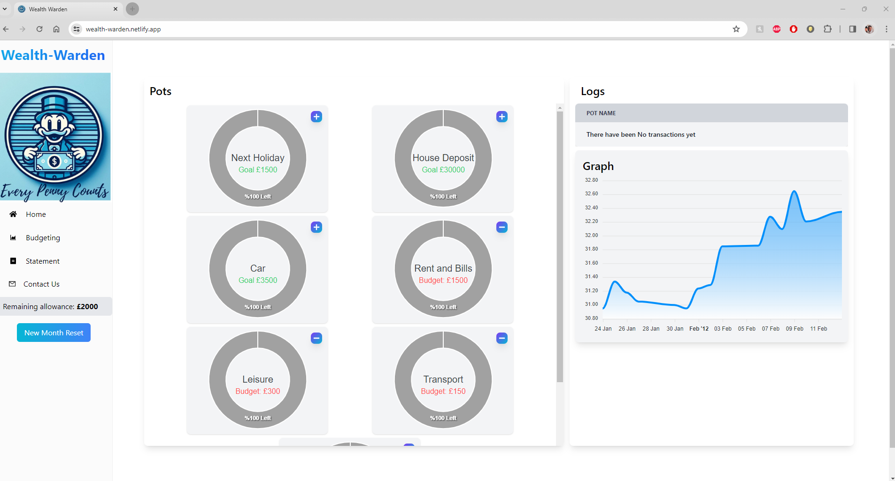
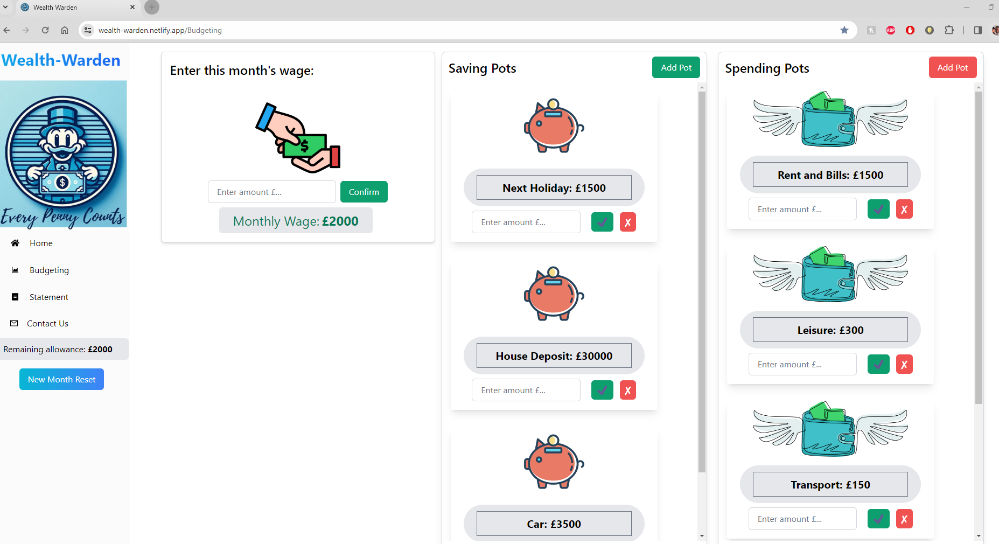
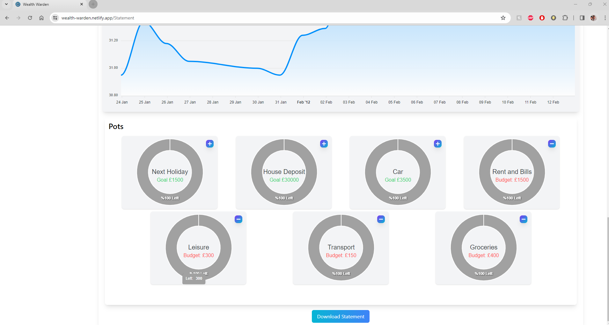
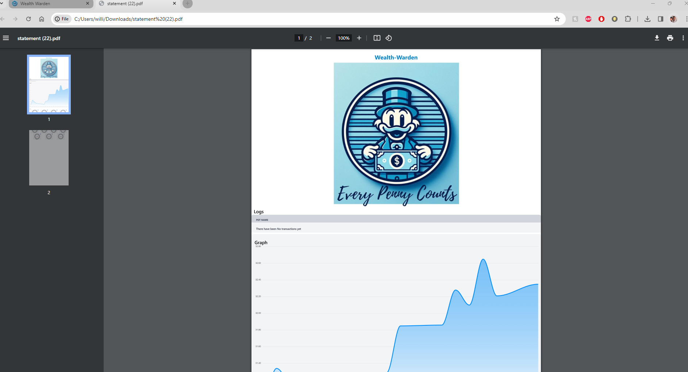
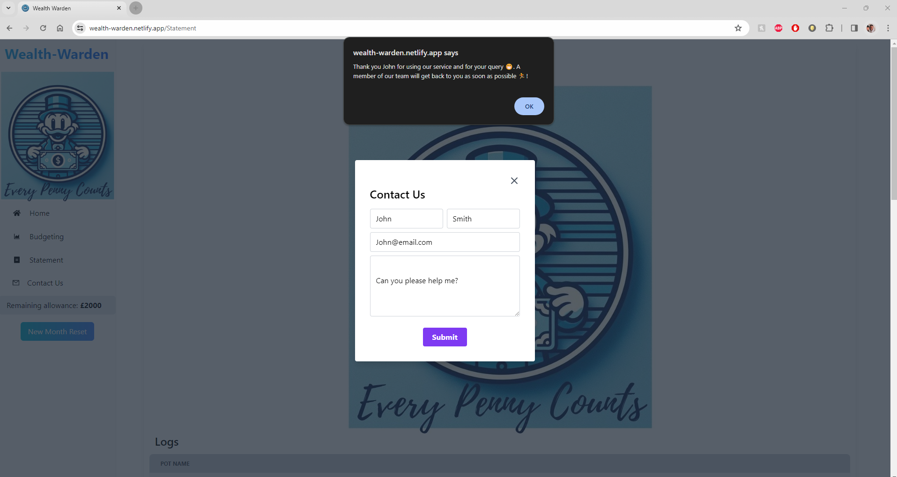

# Wealth-Warden

## Description
Wealth-Warden is a client-side single-page application designed to assist users in monitoring and regulating their spending patterns. Serving as a financial companion, it navigates users through the intricate world of budgeting. The application begins by prompting users to input their monthly income upon initiation. It organizes expenditures into user-defined 'Pots,' facilitating the recording of every expense. Additionally, it provides an overview of spent amounts and remaining balances. For those with specific savings objectives, the app enables the setting of savings targets, motivating users to allocate a portion of their income towards savings each month. Moreover, it generates graphs and monthly PDF reports to identify trends and illustrate spending habits.

## Table of Contents
- [Dev Requirements](#dev-requirements)
- [Dev Environment Setup](#dev-environment-setup)
- [How to contribute](#how-to-contribute)
- [Technologies](#technologies)
- [Webpage Screenshot](#webpage-screenshot)
- [Credits](#credits)
- [License](#license)

## Dev Requirements
Git/GitBash, VS Code, NodeJS, React, Vite, Tailwind css and the source code, of course! : 

## Dev Environment Setup
Please make sure you have NodeJS downloaded.
To get the development environment running:
1. Clone this repo
2. Navagate to the repo on your local machine
3. run `npm i` and this will install all the required dependencies
4. run `npm run dev` to start a development server !
- `index.jsx`: Contains the js code to initialize and run the app
- `src/`: Contains all source files,pages and components to allow this app to function
- `assets/images/`: Contains all images used in the project/readme
- `index.css/App.css`: Contains all css styles used in the project

## How to contribute
1. Fork this repository
2. Clone the repository
3. Create a branch for your bug fix or feature
4. Make necessary changes and commit those changes
5. Push changes to GitHub
6. Create a pull request to this repo to submit your changes for review

## Technologies
- **React**
- **React Router**
- **JavaScript XML**
- **NodeJS**
- **Vite**
- **Postcss**
- **Bootstrap**
- **Tailwindcss**
- **Apex charts**
- **UUID (Universal unique identifier)**

## Webpage Screenshot
The following image shows the application's functionality:

* Home Page

* Budgeting Page

*Statement Page

* Statement PDF

* Contact Us

## Credits
- **Ross, Eitel, Dhvya, Temi, Kelly** - Source Code

## License
MIT License
Copyright (c) 2024 Wealth-Warden 💷
Permission is hereby granted, free of charge, to any person obtaining a copy
of this software and associated documentation files (the "Software"), to deal
in the Software without restriction, including without limitation the rights
to use, copy, modify, merge, publish, distribute, sublicense, and/or sell
copies of the Software, and to permit persons to whom the Software is
furnished to do so, subject to the following conditions:
The above copyright notice and this permission notice shall be included in all
copies or substantial portions of the Software.
THE SOFTWARE IS PROVIDED "AS IS", WITHOUT WARRANTY OF ANY KIND, EXPRESS OR
IMPLIED, INCLUDING BUT NOT LIMITED TO THE WARRANTIES OF MERCHANTABILITY,
FITNESS FOR A PARTICULAR PURPOSE AND NONINFRINGEMENT. IN NO EVENT SHALL THE
AUTHORS OR COPYRIGHT HOLDERS BE LIABLE FOR ANY CLAIM, DAMAGES OR OTHER
LIABILITY, WHETHER IN AN ACTION OF CONTRACT, TORT OR OTHERWISE, ARISING FROM,
OUT OF OR IN CONNECTION WITH THE SOFTWARE OR THE USE OR OTHER DEALINGS IN THE
SOFTWARE.
